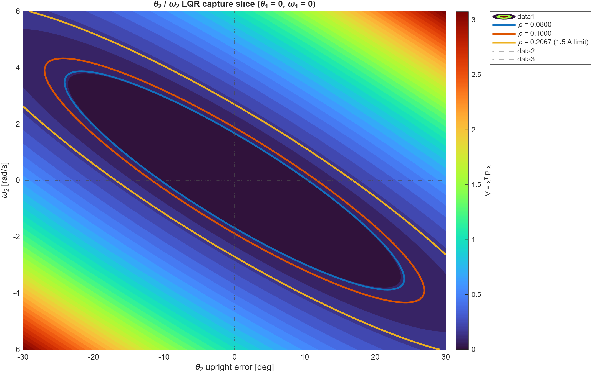
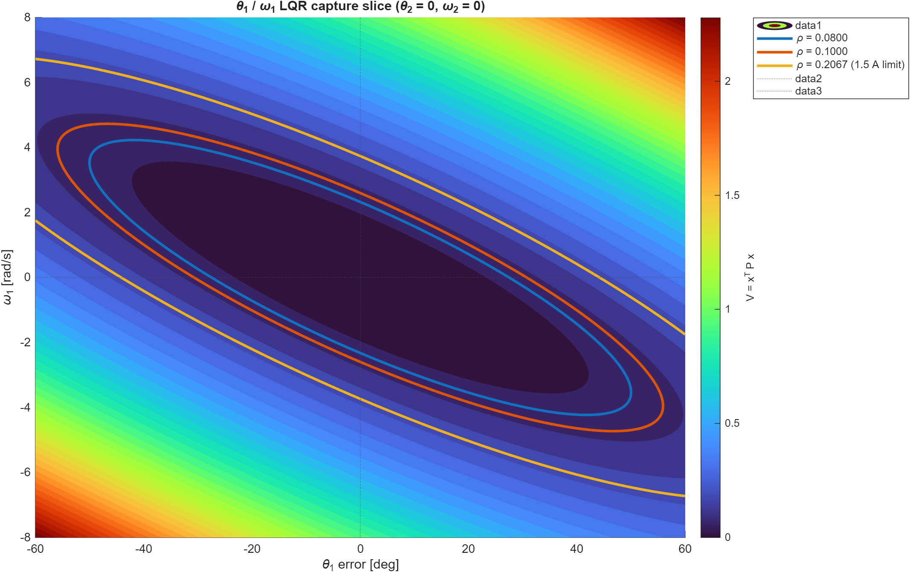
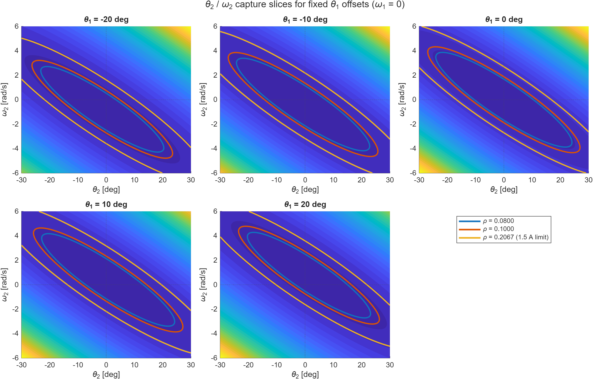
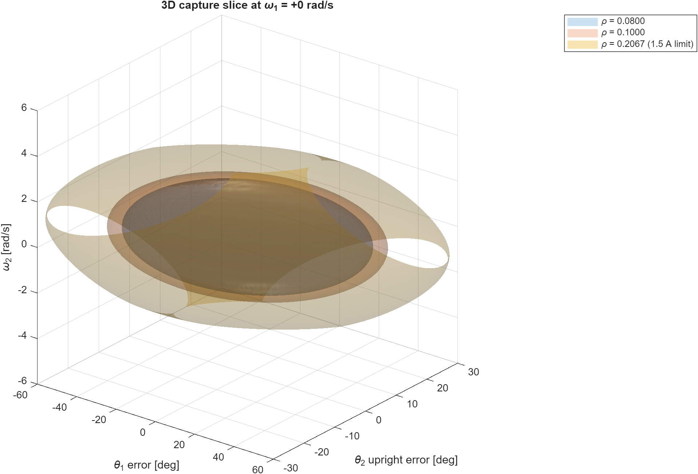

# LQR Capture Region For RL Swing-Up

Date: 2026-07-09

This note documents the capture-region discussion for using reinforcement
learning only for swing-up, then handing over to the existing upright LQR/state
space controller. It is written so parts can later be adapted into a
student-facing RT2 lab note.

## Goal

For the RT2-friendly version, the RL controller should not learn the entire
Furuta task. It should learn only:

```text
swing up -> enter a state where the existing LQR can catch and balance
```

The switching condition should therefore not be just:

```matlab
abs(theta2_error) < switch_angle
```

because angle alone is misleading. A pendulum at `30 deg` from upright with no
velocity will usually fall away. A pendulum at a larger angle may still be
catchable if it is moving toward upright with the right velocity. A pendulum at
a small angle may be impossible to catch if it is moving too fast.

The useful condition is a state-space condition based on the LQR capture
region.

## Angle Convention

The repo/course convention used by the helper scripts is:

```text
theta2 = 0      pendulum hanging downward
theta2 = pi     pendulum upright
```

The upright error is:

```matlab
theta2_error = atan2(sin(theta2 - pi), cos(theta2 - pi));
```

The local LQR state is:

```matlab
x = [theta1 - theta1_offset;
     theta2_error;
     omega1;
     omega2];
```

If `theta2_error` is positive, the measured pendulum angle is above `pi` in the
positive rotation direction. Positive `omega2` means `theta2` is increasing in
that same direction.

## LQR Ellipsoid

For the upright LQR controller:

```matlab
i = -K_oben * x
```

the linearized closed-loop system has a quadratic Lyapunov/cost function:

```matlab
V = x' * P_oben * x
```

The ellipsoid:

```matlab
x' * P_oben * x <= rho
```

is a local state-space region around upright. It includes angle and velocity,
so it is much more meaningful than a plain angle threshold.

The current repo configuration for the upright controller is:

```matlab
Q = diag([1 10 0.001 0.001]);
R = 0.5 * 10;
[K_oben, P_oben] = lqr(A, B * param.km, Q, R);
```

The computed gain is approximately:

```matlab
K_oben = [-0.4472, 3.4376, -0.1555, 0.3031]
```

Important MATLAB detail: `lqr` returns the Riccati matrix as the second output.
So use:

```matlab
[K_oben, P_oben, poles_oben] = lqr(A, B, Q, R);
```

not:

```matlab
[K_oben, ~, P_oben] = lqr(A, B, Q, R);
```

because the third output is the closed-loop poles.

## Current-Limit-Based Rho

If the current command is:

```matlab
i = -K_oben * x
```

then the maximum current over the ellipsoid `x'P_oben x <= rho` is:

```matlab
max(abs(i)) = sqrt(rho * K_oben * inv(P_oben) * K_oben')
```

To guarantee the ideal LQR command does not exceed `i_max` inside the
ellipsoid:

```matlab
rho <= i_max^2 / (K_oben * inv(P_oben) * K_oben')
```

For `i_max = 1.5 A`, the repo model gives:

```text
K_oben * inv(P_oben) * K_oben' = 10.8871
rho_max_current = 0.2067
```

This is an actuator-safe upper bound. It does not prove nonlinear capture. It
only says the ideal linear LQR command will not exceed `1.5 A` inside that
ellipsoid.

For switching and RL training, use a stricter value first:

```text
rho_capture = 0.08 or 0.10
```

This matches the practical observation that `12 deg` with no velocity is close
to the useful catch boundary, while the current-limit ellipsoid is more
optimistic.

## Why Velocity Can Help

In the simplified slice:

```matlab
theta1 = 0
omega1 = 0
x = [0; theta2_error; 0; omega2]
```

the cost is:

```matlab
V = P22*theta2_error^2 ...
  + 2*P24*theta2_error*omega2 ...
  + P44*omega2^2
```

Using the current `P_oben`:

```text
P22 = 2.3994
P24 = 0.2348
P44 = 0.02831
```

The cross-term is why the capture region is tilted. For a positive
`theta2_error`, a negative `omega2` can be helpful because the pendulum is
moving back toward upright. But too much speed is bad again.

With `rho = 0.08`, the zero-velocity angle limit in this slice is about:

```text
abs(theta2_error) <= 10.5 deg
```

With the best correcting velocity, the theoretical angle can reach about:

```text
abs(theta2_error) <= 24.1 deg
```

That `24.1 deg` is a best-case boundary, not a safe angle threshold. At that
angle, only a narrow velocity range is inside the ellipsoid.

Practical interpretation:

```text
small angle + low speed: usually catchable
larger angle + correcting velocity: maybe catchable
larger angle + zero velocity: usually not catchable
larger angle + wrong velocity: not catchable
small angle + huge velocity: not catchable
```

## Generated Plots

The plotting script is:

```text
scripts/analysis/plotLqrCaptureRegionSlices.m
```

Run from the repository root:

```matlab
addpath(genpath("scripts"));
out = plotLqrCaptureRegionSlices();
```

The generated figures are saved in:

```text
outputs/lqr_capture_region/
```

### Theta2/Omega2 Slice

This is the most useful student-facing picture. It fixes `theta1 = 0` and
`omega1 = 0`, then shows the capture region in the pendulum angle/velocity
plane.



The blue/orange ellipses are stricter capture candidates. The yellow curve is
the larger `1.5 A` current-limit bound.

### Theta1/Omega1 Slice

This fixes `theta2_error = 0` and `omega2 = 0`, then shows the arm-position and
arm-velocity contribution to the same LQR state metric.



### Theta2/Omega2 Slices For Different Theta1 Offsets

This plot shows how the acceptable pendulum angle/velocity region changes when
the rotary arm is not centered.



This is useful for explaining why the RL swing-up policy should not only care
about pendulum angle. It should also avoid delivering the pendulum to upright
while the arm is far from its desired center.

### 3D Slices

The full ellipsoid is four-dimensional. The 3D plots fix `omega1` and show
surfaces in:

```text
theta1_error, theta2_error, omega2
```

Static preview for `omega1 = 0`:



Interactive MATLAB `.fig` files were generated for:

```text
omega1 = +5, +2, 0, -2, -5 rad/s
```

Open these in MATLAB to rotate and zoom:

```text
outputs/lqr_capture_region/theta1_theta2_omega2_slice_omega1_plus5.fig
outputs/lqr_capture_region/theta1_theta2_omega2_slice_omega1_plus2.fig
outputs/lqr_capture_region/theta1_theta2_omega2_slice_omega1_plus0.fig
outputs/lqr_capture_region/theta1_theta2_omega2_slice_omega1_minus2.fig
outputs/lqr_capture_region/theta1_theta2_omega2_slice_omega1_minus5.fig
```

## Helper Function

The capture-region test function is:

```text
scripts/analysis/isInLqrCaptureRegion.m
```

Basic use with measured `theta2`:

```matlab
[inside, info] = isInLqrCaptureRegion( ...
    theta1, theta2, omega1, omega2, ...
    CurrentLimit=1.5, ...
    Rho=0.08);
```

Use this if `theta2` is already the upright error:

```matlab
[inside, info] = isInLqrCaptureRegion( ...
    theta1, theta2_error, omega1, omega2, ...
    CurrentLimit=1.5, ...
    Rho=0.08, ...
    Theta2IsError=true);
```

The function returns:

```matlab
inside              % true/false
info.V              % x' * P * x
info.Rho            % rho used for this check
info.RhoMaxCurrent  % rho implied by CurrentLimit
info.ILqr           % current the LQR would command
info.K
info.P
```

It also returns individual flags:

```matlab
info.EllipsoidOk
info.CurrentOk
info.Theta1Ok
info.Theta2Ok
info.Omega1Ok
info.Omega2Ok
```

The helper checks both the ellipsoid and the current limit:

```matlab
inside = V <= rho ...
      && abs(i_lqr) <= CurrentLimit ...
      && optional_guard_limits;
```

If `Rho` is omitted, the function computes:

```matlab
rho = CurrentLimit^2 / (K_oben * inv(P_oben) * K_oben')
```

If `Rho` is provided, that stricter/manual value is used, while the current
limit remains an extra guard.

An example script is:

```text
scripts/analysis/exampleLqrCaptureRegionCheck.m
```

Run:

```matlab
addpath(genpath("scripts"));
scripts/analysis/exampleLqrCaptureRegionCheck
```

## Recommended Use In RL Training

For a first swing-up-only TD3 experiment:

```text
train RL until it enters the verified LQR capture region
terminate the episode successfully there
do not include the LQR controller inside the first training loop
```

Candidate success condition:

```matlab
[captured, capInfo] = isInLqrCaptureRegion( ...
    theta1, theta2, omega1, omega2, ...
    CurrentLimit=1.5, ...
    Rho=0.08, ...
    Theta1Guard=deg2rad(25), ...
    Theta2Guard=deg2rad(24), ...
    Omega1Guard=5, ...
    Omega2Guard=6);
```

The explicit guards are not mathematically necessary if the ellipsoid is used,
but they are useful for safety, readability, and student-facing explanations.

## Nonlinear Capture Region

The LQR ellipsoid is based on the linearized upright model. It is a local,
analytical proxy. It does not prove that the nonlinear plant can always be
caught.

A nonlinear capture region can be estimated by simulation:

1. Sample initial states around upright.
2. Simulate the nonlinear Furuta plant with the upright LQR and current
   saturation.
3. Mark each initial state as success/failure.
4. Compare the successful set with `x'P_oben x <= rho`.
5. Choose a conservative `rho_capture` that lies inside the verified nonlinear
   success region.

This is the right next step if the analytical region is still too optimistic on
hardware or in the detailed nonlinear model.

## Student-Facing Summary

A compact explanation for students could be:

```text
The LQR controller is only valid near the upright equilibrium. Instead of
switching based only on the pendulum angle, we use the LQR cost

    V = x' P x

as a measure of whether the full state is close enough to upright. This state
includes angle and angular velocity. Therefore, a pendulum farther away from
upright can still be catchable if it is moving in the right direction, while a
pendulum close to upright may be impossible to catch if it is moving too fast.
The RL swing-up controller is successful when it enters this LQR capture
region.
```
