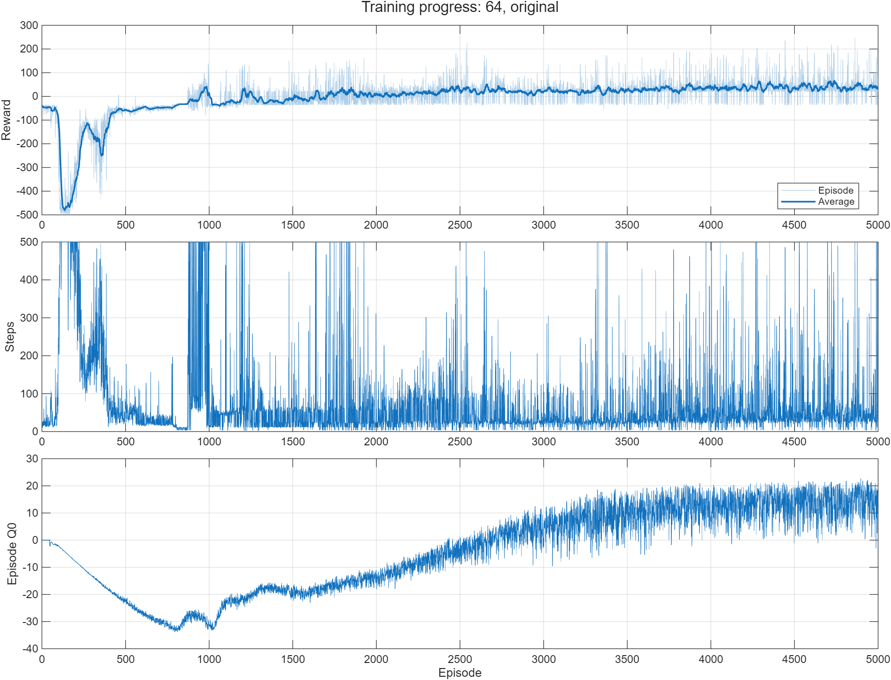
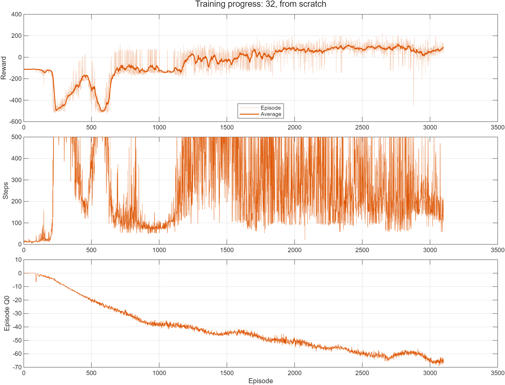
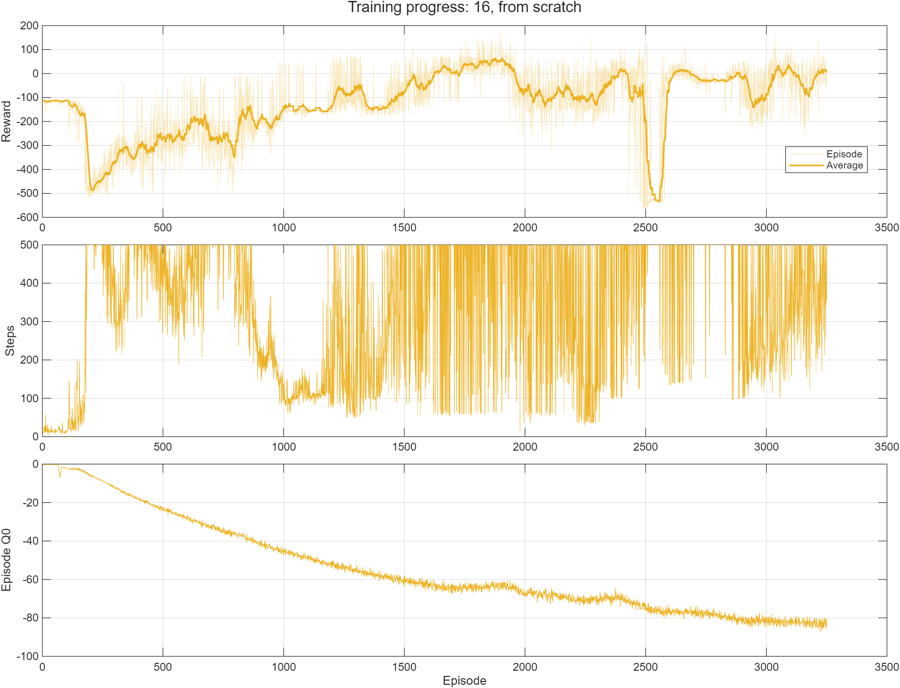
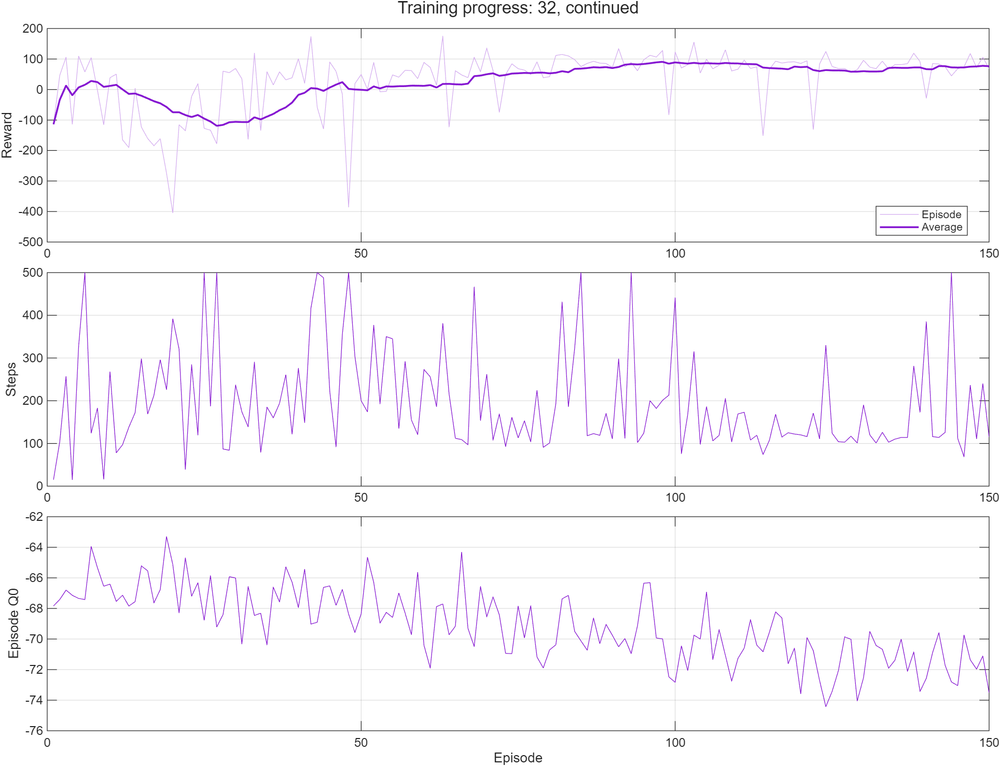
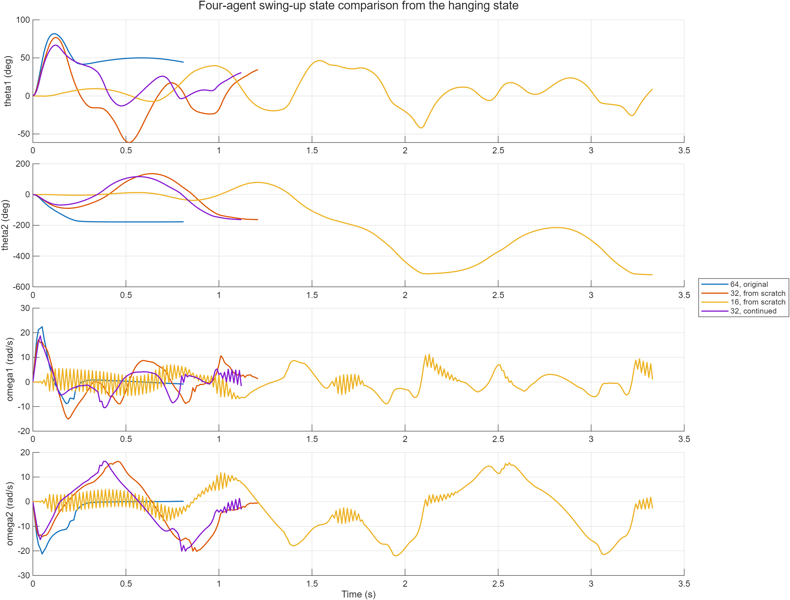
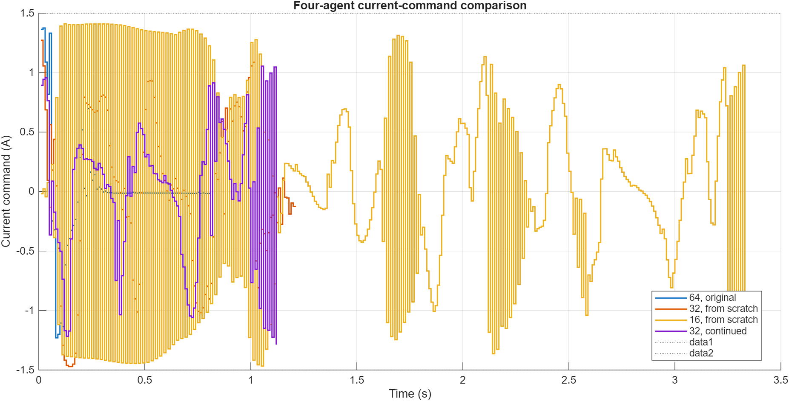
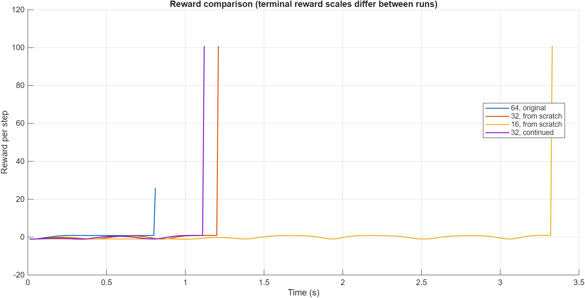
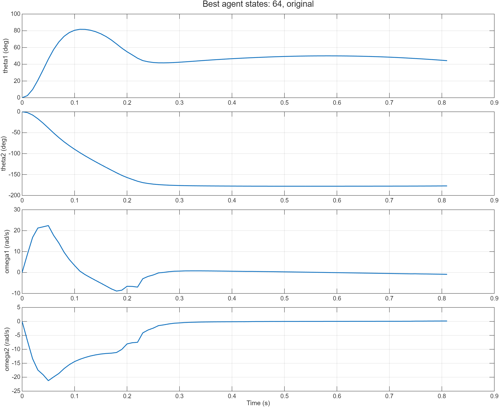
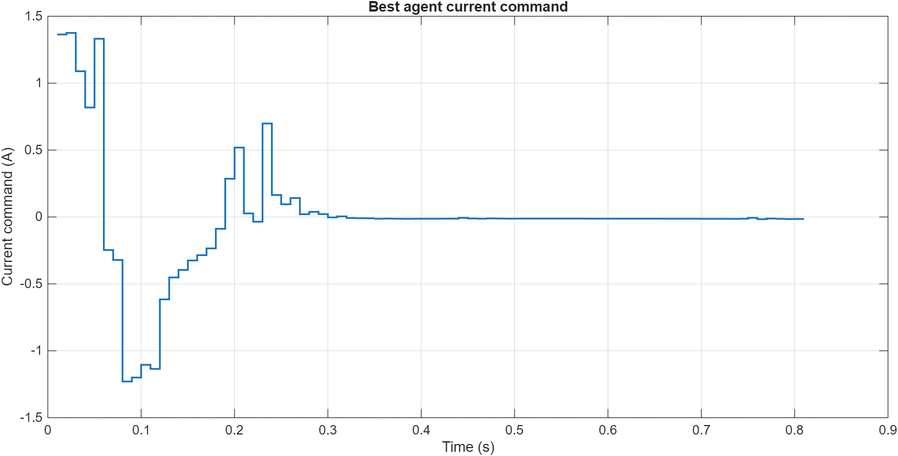
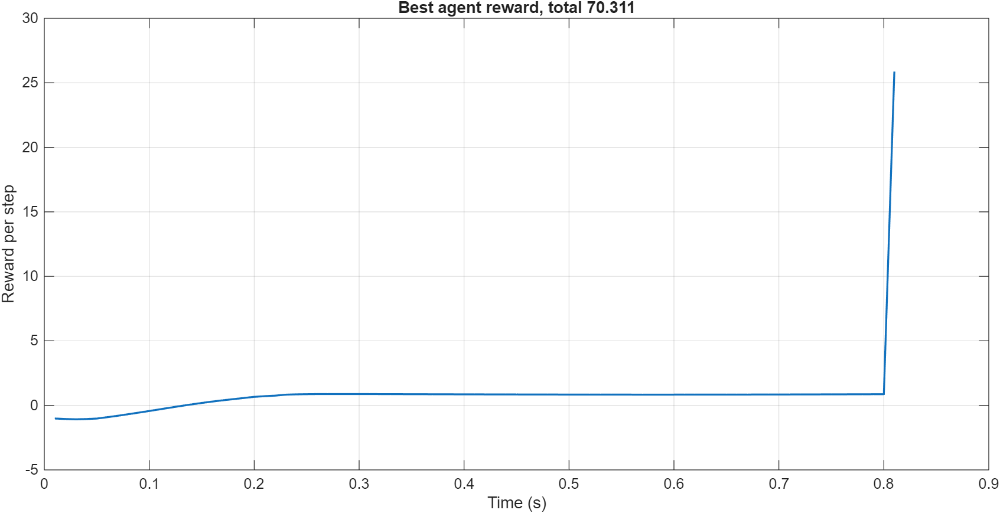

# MATLAB TD3 swing-up training comparison

Date: 2026-07-30

## Purpose

This note compares four MATLAB analytical-plant TD3 training runs. The main
question is whether smaller networks and continued training reduce the cost of
student training while retaining a smooth and reliable Furuta swing-up policy.

The final saved agent from each run was evaluated from the same physical initial
state:

```matlab
theta0 = [0; 0];
omega0 = [0; 0];
```

The rollout stops when the state enters the configured LQR capture region. No
LQR balancing action is simulated in these plots; the endpoint denotes where
the LQR controller would take over.

## Runs and results

| Run | Actor / critics | Episodes | Training time | Capture time | Current RMS | Current variation | Variation rate | Current-effort integral |
|---|---:|---:|---:|---:|---:|---:|---:|---:|
| `run_20260728_153540_td3_matlab_analytical_100hz_fast` | 1x64 / 2x64 | 5000 | about 3 h 32 min | **0.81 s** | **0.429 A** | **7.64 A** | **9.44 A/s** | **0.149 A^2 s** |
| `run_20260730_195820_td3_matlab_ode3_student_100hz_actor1x32_critic2x32` | 1x32 / 2x32 | 3100 | about 1 h 51 min | 1.21 s | 0.663 A | 23.33 A | 19.28 A/s | 0.532 A^2 s |
| `run_20260730_210332_882_td3_matlab_ode3_student_100hz_actor1x16_critic2x16` | 1x16 / 2x16 | 3250 | about 1 h 20 min | 3.33 s | 0.855 A | 362.23 A | 108.78 A/s | 2.432 A^2 s |
| `run_20260730_220652_985_resume_20260730_195820_td3_matlab_ode3_student_100hz_actor1x32_critic2x32` | 1x32 / 2x32 | 150 additional | 4 min 38 s | 1.12 s | 0.579 A | 42.64 A | 38.07 A/s | 0.375 A^2 s |

The first three durations are estimates from the run-name start timestamp to
the final agent-file timestamp. The continued run records an exact elapsed time
in `resumeInfo`.

All four final agents reach the capture region in this nominal rollout. The
original 64-neuron agent is the best of these agents: it captures fastest and
has both the lowest RMS current and the lowest current-command total variation.
The latter metric supports the visual observation that it is less oscillatory.

The 32-neuron agent trained from scratch is usable, but captures later and has
roughly three times the command variation of the 64-neuron agent. Continuing its
training improves the nominal capture time slightly, but increases command
variation from 23.33 A to 42.64 A. This is evidence that additional TD3 training
did not monotonically improve the saved policy.

The 16-neuron agent is not a good candidate in its current form. Its current
total variation is about 47 times that of the best agent, and its rollout takes
several swings before reaching the capture region.

## Oscillation and energy metrics

The comparison script reports several complementary metrics:

- `CurrentTotalVariation = sum(abs(diff(i)))` measures accumulated command
  movement. It grows when the command repeatedly jumps or oscillates.
- `CurrentVariationRate = CurrentTotalVariation / captureTime` removes the
  advantage or disadvantage of a shorter rollout. The 16-neuron agent remains
  by far the most oscillatory at 108.78 A/s.
- `CurrentDirectionReversals` counts changes of command direction after ignoring
  values below 0.05 A. This suppresses sign changes caused by near-zero noise.
- `SquaredCurrentIntegral = integral(i^2 dt)` is the current-effort or Joule-loss
  proxy. It combines command magnitude and time to capture.
- `SquaredCurrentIntegral / captureTime = CurrentRms^2` is the effort normalized
  by catch time. Lower values mean less average current stress while swinging up.
- `AbsoluteCurrentIntegral = integral(abs(i) dt)` measures total current demand
  without squaring peaks.
- `AbsoluteMechanicalWork = integral(abs(km*i*omega1) dt)` estimates total
  magnitude of work exchanged at the motor shaft.

The script also calculates an estimated electrical energy drawn:

```text
Pmotor = R*i^2 + km*i*omega1
Eelectrical = integral(max(Pmotor, 0) dt)
```

This estimate uses the quasi-static motor relation `v = R*i + km*omega1` and
counts only positive power draw. It is not measured battery energy: the
analytical training plant omits the PI current loop, winding inductance, driver
losses, supply limits, and a detailed regeneration model. For comparing these
policies, `SquaredCurrentIntegral` is the cleaner model-independent metric.

## Training progress

### 1. Original 1x64 actor and 2x64 critics



### 2. 1x32 actor and 2x32 critics, trained from scratch



### 3. 1x16 actor and 2x16 critics, trained from scratch



### 4. Continued 1x32 actor and 2x32 critics



The fixed-case evaluation results observed during training also show why the
best checkpoint should be retained separately from the final checkpoint. A
policy can reach a high success count and then regress as critic and actor
updates continue.

## Four-agent evaluation

### States



### Current command



### Reward



Reward magnitudes must not be compared directly across all four runs. The older
64-neuron run used the earlier terminal reward settings, whereas the newer runs
use a capture bonus of 100, unsafe penalty of 100, and timeout penalty of 10.
State behavior, capture success, capture time, and command smoothness are more
meaningful cross-run measures here.

## Best agent evaluation

The best final agent in this comparison is:

`run_20260728_153540_td3_matlab_analytical_100hz_fast`

### States



### Current command



### Reward



## Observation convention compatibility

Yes, the evaluation script works for the original July 28 agent despite its
different observation convention. It selects the environment from the saved
configuration:

```matlab
usesSimulinkConvention = isfield(cfg.Observation, "ErrorConvention") && ...
    string(cfg.Observation.ErrorConvention) == "reference_minus_measurement";
```

The July 28 configuration has no `ErrorConvention` field, so evaluation uses
`createFurutaAnalyticalSwingupEnv`, which provides the legacy convention on
which that agent was trained. New configurations declare
`reference_minus_measurement` and use
`createFurutaAnalyticalSwingupEnvSimulinkConvention`.

This automatic selection is essential. Feeding the July 28 agent the newer
observation signs would not be an equivalent evaluation. In Simulink, the
previously tested multiplication of the error vector by `-1` performs the
corresponding conversion for that legacy agent.

## Interpretation limits

The comparison is useful but is not a controlled network-size experiment. The
July 28 run uses the legacy observation convention and RK4 integration, while
the newer runs use the established Simulink error convention and ODE3. Reward
parameters also changed. Therefore the results identify the best saved agent,
but do not prove that 64 neurons alone caused the improvement.

A stronger teaching comparison should evaluate multiple initial conditions and
random seeds, save the best fixed-case checkpoint, and hold the observation
convention, solver, reward, update count, and stopping rule constant.

The separate 1x64/2x64 convention-correct student run
`run_20260730_181326_td3_matlab_ode3_student_100hz` is intentionally not one of
the four policy rollouts above because it did not produce a successful final
swing-up policy. It is nevertheless an important training-cost experiment. Its
batch-128, 10-update-per-episode budget processed at most 1,280 replay samples
per episode, compared with batch 256, 25 updates, and 6,400 samples per episode
for the successful July 28 fast baseline. The smaller budget shortened learning
pauses, but the reward progression indicated that 3,000 episodes were
insufficient and perhaps another 2,000 to 3,000 would have been needed.

The practical lesson is that optimizing episode throughput alone can be
misleading. If swing-up requires a broadly similar cumulative number of useful
updates, fewer updates per episode merely move the work into more episodes and
may not reduce end-to-end training time. This observation led to the 32- and
16-neuron experiments as an alternative way to reduce update cost. See
`docs/matlab_analytical_swingup_result_2026-07-30.md` for the full configuration
comparison and interpretation.

## Reproduction files

The plots and summary table are generated by:

`scripts/analysis/compareFourMatlabSwingupRuns.m`

Machine-readable results and MATLAB figures are in:

`outputs/matlab_swingup_four_run_comparison/`

The `.fig` versions can be opened in MATLAB for zooming, data cursors, and plot
editing. The CSV contains the numeric summary used in this note.

## Viewing this note in VS Code

The image paths in this file are relative to the Markdown document and work in
VS Code's built-in Markdown preview. Open this file and use `Ctrl+Shift+V` for a
preview tab or `Ctrl+K V` for a preview beside the source. Opening the repository
folder as the VS Code workspace keeps all `../outputs/...` image paths resolvable.

VS Code previews the PNG files directly. It cannot render MATLAB `.fig` files;
open those in MATLAB when interactive zooming, data cursors, or plot editing are
needed. If an image is stale in the preview after regeneration, close and reopen
the preview or run `Markdown: Refresh Preview` from the Command Palette.
